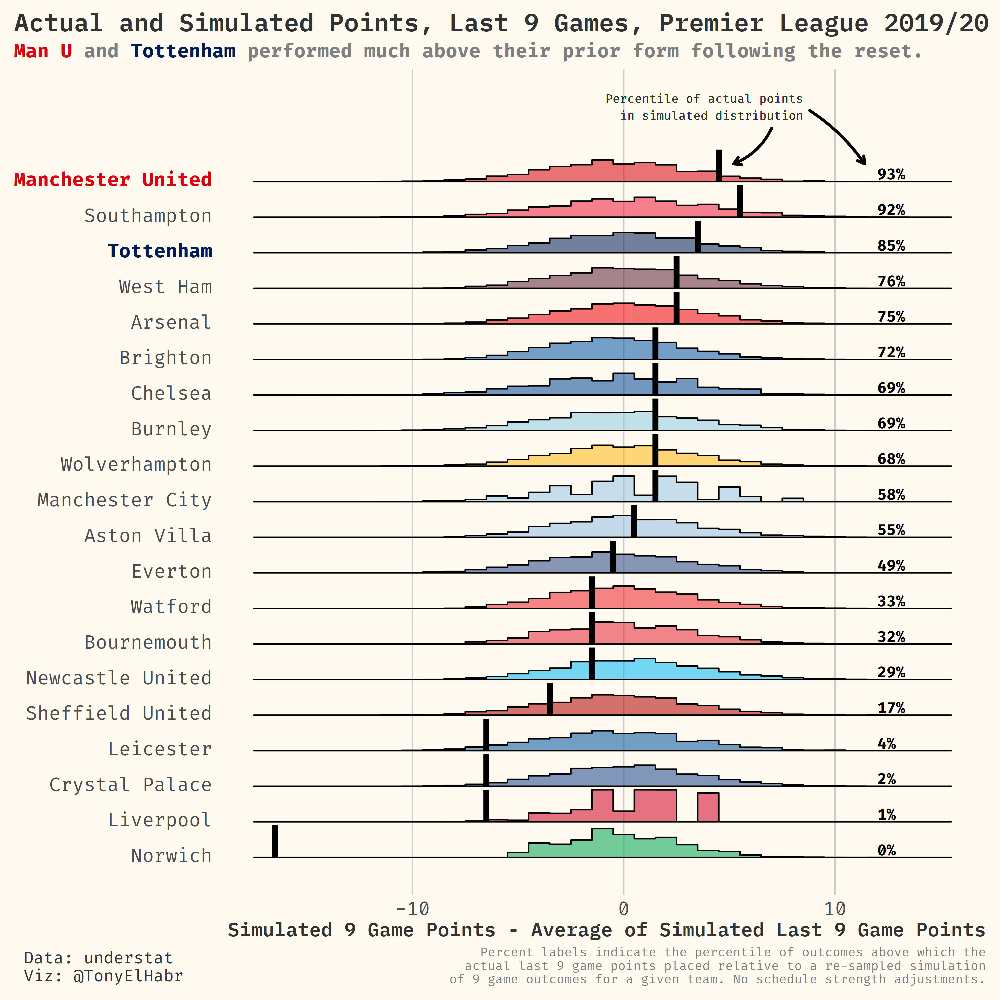
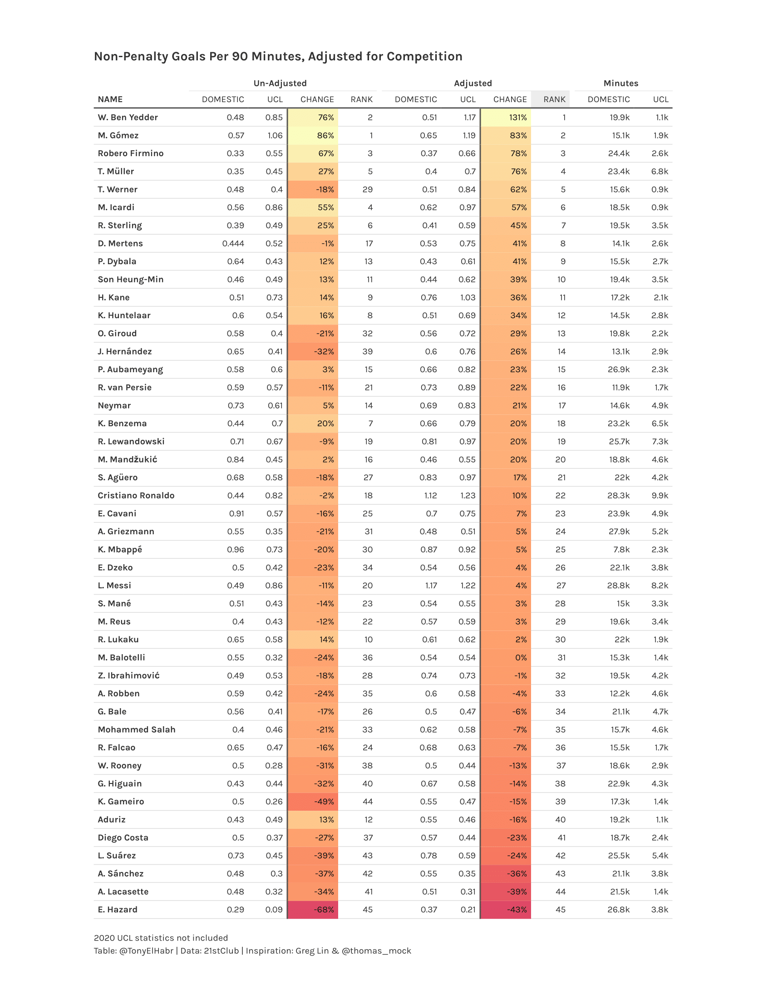
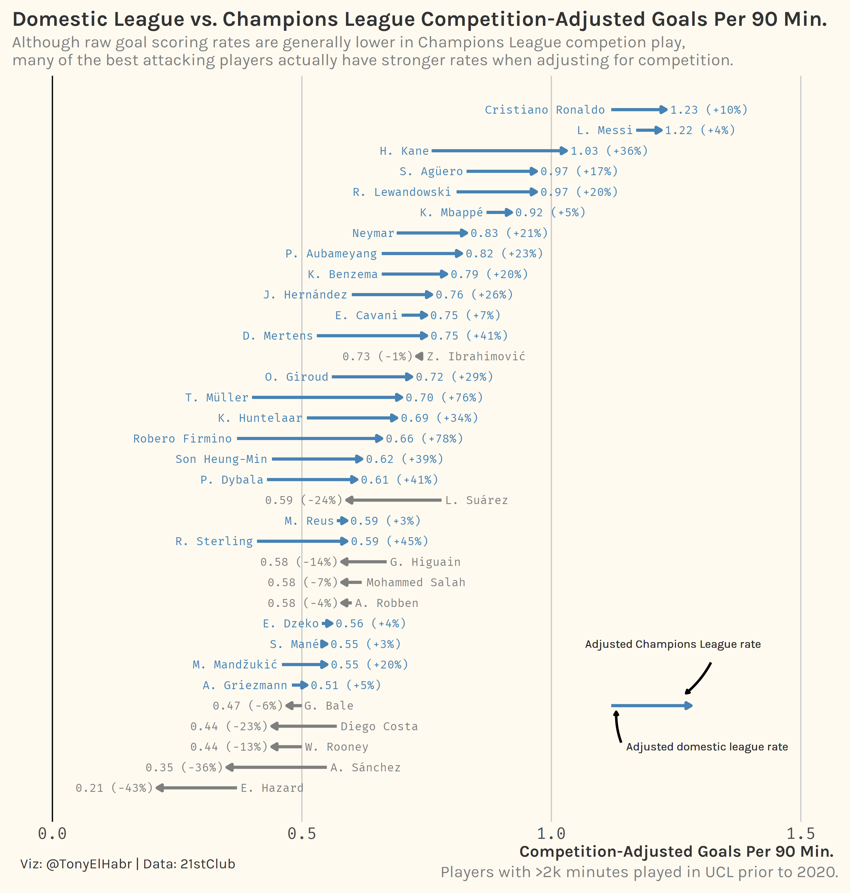
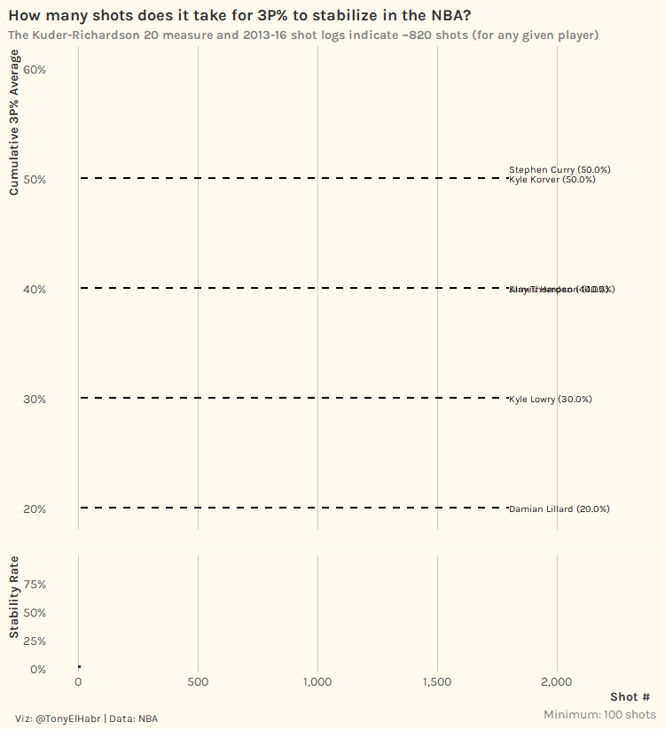
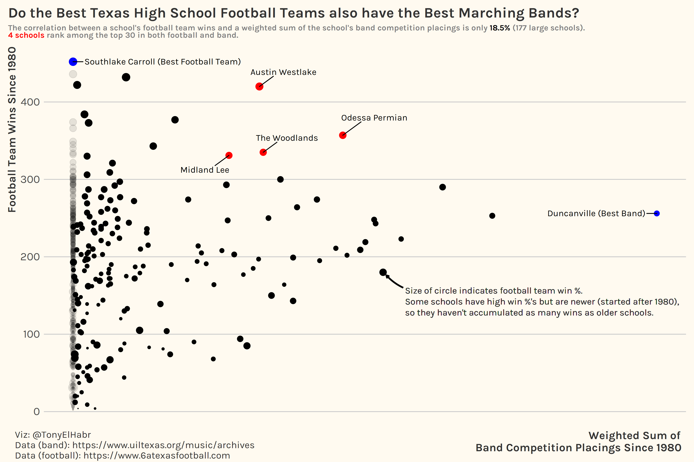

```{r setup, include=FALSE}
knitr::opts_chunk$set(echo = FALSE)
```

This repo stores my code and plots for sports-related plots.





```{r ucl_npg90_adj_pdf, echo=F, include=F, eval=F}
knitr::include_graphics('plots/04_ucl_npg90_adj.utf8.pdf')
```









## Future Ideas

+ Stability of goal-scoring rate and/or xG over-performance

+ Madden rating EDA with UMAP + kmeans clustering (for optimal # of UMAP groups).

+ In which sport is the leading team most likely to further their lead near the end of the game due to an opposition error, overly-aggressive tactics by the opposition, etc.? (End of game depends on the sport. Ideally, we could use a win probability model to help idenitfy end-of-game context, although it would still need some adjustment.) Extension: In which sport are gamblers most likely to lose/win due to a back-door cover?

+ Decision tree to filter down players in a sport to just one player who has achieved a very specific set of career totals/averages (i.e. https://twitter.com/JacobEGoldstein/status/1296570734047686658)

## Future data sets

+ "Standardized" soccer shot data locations: https://kloppy.pysport.org/changelog/#110-2020-08-07

+ xG soccer model: https://github.com/ML-KULeuven/soccer_xg

+ Transfer market data: https://github.com/ewenme/transfers

+ FIFA data: https://github.com/RobWHickman/fifadb
